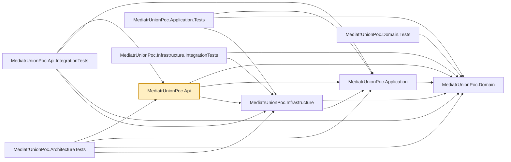

# MediatrUnionPoc.Api

The ASP.NET Core host. One controller, `ProductsController`, whose every action does exactly one
thing: send a command/query via MediatR, then `switch` on the returned union to produce an
`IActionResult`. That `switch` is the only place in the whole solution where a union outcome gets
translated into an HTTP status — handlers and validators never touch `IActionResult` or any other
web concern. See the repo root README's
[Switch-and-unwrap: why controllers never return the union directly](../../README.md#switch-and-unwrap-why-controllers-never-return-the-union-directly)
for why, and its [Authorization](../../README.md#authorization) section for how the two
`X-Admin`/`X-Caller-Id` request headers this controller reads stand in for real authentication.

## HTTP mapping (`Http/`)

The controller keeps its own exhaustive `switch`; the repeated failure arms are one-line calls to
C# 14 extension members in `MediatrUnionPoc.Api.Http` (`ResultHttpExtensions`):
`error.ToProblemResult(HttpContext)`, `notFound.ToProblemResult(HttpContext, resource: "Product")`,
`notAuthorized.ToProblemResult(HttpContext)`, `errors.ToProblemResult(HttpContext)`, plus the static
`ClaimsPrincipal.FromCallerHeaders(adminHeader, callerIdHeader)`. Every failure body is
`application/problem+json`; the 404 carries a `code` member (`"NOT_FOUND"`).

- `HttpMappingOptions` (registered by `AddResultHttpMapping(Action<HttpMappingOptions>?)` in
  `Program.cs`, resolved through `HttpContext.RequestServices`): `ErrorStatusCodes` maps an
  `Error.Code` to a status (default `VALIDATION_ERROR` to 400; `DefaultErrorStatusCode` 500 for the
  rest), `IncludeTypeUris` / `TypeUris` control the RFC 7807 `type` member.
- Each extension takes optional per-call overrides (`statusCode`, `title`, `detail`) to treat one
  case differently, and everything is public: write a hand-rolled arm or your own extension members
  whenever the built-ins do not fit.

Uses the `Microsoft.NET.Sdk.Web` SDK (not the plain `Microsoft.NET.Sdk` the other projects use),
since it's the one project that's actually a runnable web application.

## Dependencies

**Project references:**

- `MediatrUnionPoc.Domain`, `MediatrUnionPoc.Application`, `MediatrUnionPoc.Infrastructure` — the
  full stack; `Program.cs` composes the app by calling each layer's `Add*()` registration method.

**Key packages:**

- `Microsoft.AspNetCore.OpenApi` — generates the OpenAPI document (`/openapi/v1.json`), including
  the request examples described in the repo root `README.md`.

Also carries the repo-wide analyzer package set (`AsyncFixer`, `IDisposableAnalyzers`,
`Microsoft.VisualStudio.Threading.Analyzers`, `SonarAnalyzer.CSharp`, `StyleCop.Analyzers`).



## Usage

Run locally:

```bash
dotnet run --project src/MediatrUnionPoc.Api
```

Then hit `ProductsController`'s endpoints, or browse the generated OpenAPI document. Action names
keep their `Async` suffix in MVC's route/action metadata — `Program.cs` sets
`SuppressAsyncSuffixInActionNames = false` (ASP.NET Core's default is `true`), because
`CreatedAtAction`'s `nameof(GetByIdAsync)` calls would otherwise silently stop matching the action
name MVC registers.

There's nothing to configure beyond what `Program.cs` already wires up. Persistence is SQLite;
with no `ConnectionStrings:Products` value the app uses a private in-memory database created at
startup, so each run starts with an empty product catalog. Set `ConnectionStrings:Products` to a
SQLite connection string (for example `Data Source=products.db`) to persist across runs.
