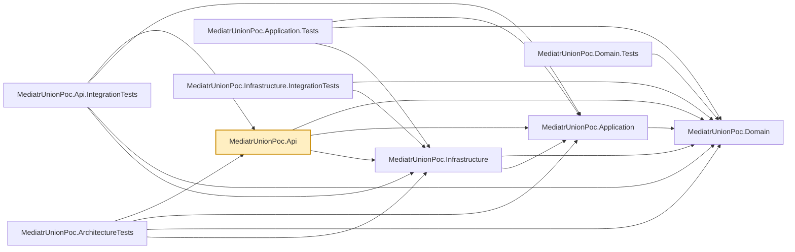

# MediatrUnionPoc.Api

The ASP.NET Core host. One controller, `ProductsController`, whose every action does exactly one
thing: send a command/query via MediatR, then `switch` on the returned union to produce an
`IActionResult`. That `switch` is the only place in the whole solution where a union outcome gets
translated into an HTTP status — handlers and validators never touch `IActionResult` or any other
web concern. See the repo root README's
[Switch-and-unwrap: why controllers never return the union directly](../../README.md#switch-and-unwrap-why-controllers-never-return-the-union-directly)
for why, and its [Authorization](../../README.md#authorization) section for how the two
`X-Admin`/`X-Caller-Id` request headers this controller reads stand in for real authentication.

## HTTP mapping (`Http/`)

The controller keeps its own exhaustive `switch`; the repeated failure arms are one-line calls to
C# 14 extension members in `MediatrUnionPoc.Api.Http` (`ResultHttpExtensions`):
`error.ToProblemResult(HttpContext)`, `notFound.ToProblemResult(HttpContext, resource: "Product")`,
`notAuthorized.ToProblemResult(HttpContext)`, `errors.ToProblemResult(HttpContext)`,
`preconditionFailed.ToProblemResult(HttpContext)` (412), `conflict.ToProblemResult(HttpContext)`
(409), `missingIfMatch.ToProblemResult(HttpContext)` (428), plus the static
`ClaimsPrincipal.FromCallerHeaders(adminHeader, callerIdHeader)`. Every failure body is
`application/problem+json`; the 404 carries a `code` member (`"NOT_FOUND"`).

- `HttpMappingOptions` (registered by `AddResultHttpMapping(Action<HttpMappingOptions>?)` in
  `Program.cs`, resolved through `HttpContext.RequestServices`): `ErrorStatusCodes` maps an
  `Error.Code` to a status (default `VALIDATION_ERROR` to 400; `DefaultErrorStatusCode` 500 for the
  rest), `IncludeTypeUris` / `TypeUris` control the RFC 7807 `type` member.
- Each extension takes optional per-call overrides (`statusCode`, `title`, `detail`) to treat one
  case differently, and everything is public: write a hand-rolled arm or your own extension members
  whenever the built-ins do not fit.

## ETag and If-Match (`Http/`)

Products carry an optimistic-concurrency version, exposed as a weak ETag `W/"n"`. `GET` by id and
`POST` return it in the `ETag` header (and `ProductDto` has a `version` member); a successful `PUT`
returns the new one with `204`. `PUT` requires `If-Match`: missing is `428`, malformed is a `400`
validation problem naming the header, stale is `412`. On `DELETE` it is optional, and enforced when
present. `IfMatchHeader.Parse` classifies the header (`ProductVersion`, `MissingIfMatch` or
`ValidationErrors`) so both actions share one parser, and `Response.SetETag(version)`
(`ETagHttpExtensions`) writes the header. The OpenAPI document declares the `409`/`412`/`428` responses
with example bodies (`PreconditionProblemExampleTransformer`) and the `ETag` response header on
actions marked `[ReturnsETag]` (`ETagResponseHeaderTransformer`). See the repo root README's
[Optimistic concurrency](../../README.md#optimistic-concurrency-productversion-etag-and-if-match).

## Listing: filters, sort, paging headers (`Contracts/`, `Http/`, `OpenApi/`)

`GET /api/products` binds a `ListProductsRequest` (`Contracts/ProductContracts.cs`) from the query
string (`nameContains`, `minPrice`, `maxPrice`, `ownerId`, `sort`, `pageNumber`, `pageSize`; binding
is case-insensitive) and sends a `GetPagedProductsQuery`. `GetPagedProductsResult` has a real
`ValidationErrors` case, so bad input answers `400` with per-field `errors` like every other
validated action; the action's `switch` has no `Error` special case for validation. The `200` body
is a `PagedResult<ProductDto>` (applied sort, `totalCount`, `totalPages`, `firstPage`, `lastPage`,
`nextPage`, `previousPage`), and `Response.SetPagingHeaders(page)` (`PagingHttpExtensions`) adds
`X-Total-Count` and an RFC 8288 `Link` header (`first`, `prev`, `next`, `last`; `prev`/`next` omitted
at the ends; the request URL with only `pageNumber` replaced). The OpenAPI document declares those
headers on actions marked `[ReturnsPagingHeaders]` (`PagingResponseHeaderTransformer`) and carries an
example paged body (`ProductContractExampleTransformer`). See the repo root README's
[Listing products](../../README.md#listing-products-filtering-sorting-and-paging).

## Trace id and unhandled exceptions (`Http/`)

- **Trace id.** `HttpContext.TraceId` (extension member in `HttpContextTraceExtensions`) is the
  single accessor: the W3C trace id of `Activity.Current` when there is one (so it joins to
  distributed traces), otherwise `HttpContext.TraceIdentifier`; never empty. It appears in three
  places, always with the same value: the `traceId` member of **every** `application/problem+json`
  body (including framework-generated ones: model-binding 400, routing 404, 415, unhandled 500,
  via `AddApiProblemDetails()` + `UseStatusCodePages()`), an `X-Trace-Id` header on **every**
  response (success included; success bodies are unchanged), and a `TraceId` logging scope opened
  by `TraceIdMiddleware` so every log line written during the request carries it.
- **Global exception handler.** `GlobalExceptionHandler` (`IExceptionHandler`, wired with
  `AddExceptionHandler` + `UseExceptionHandler`) turns any exception nothing else caught into a 500
  problem body. There is no per-exception-type status mapping: expected outcomes are unions and
  everything else is a 500 (an `Error` case still maps through `HttpMappingOptions`). The title is
  generic; `detail` (the exception text) is written only when the environment is Development. The
  exception is logged at Error with structured properties (the trace id comes from the scope).
  A client abort (`OperationCanceledException` while `RequestAborted` is cancelled) is swallowed:
  no body, Debug log only.
- **Exception-tracking plug-in points.** No tracker is bundled. The trace id is the join key to
  whichever you add: OpenTelemetry (vendor-neutral exception events on spans), Serilog with Seq
  (the `TraceId` scope property becomes a searchable field), or Sentry.

Uses the `Microsoft.NET.Sdk.Web` SDK (not the plain `Microsoft.NET.Sdk` the other projects use),
since it's the one project that's actually a runnable web application.

## Dependencies

**Project references:**

- `MediatrUnionPoc.Domain`, `MediatrUnionPoc.Application`, `MediatrUnionPoc.Infrastructure` — the
  full stack; `Program.cs` composes the app by calling each layer's `Add*()` registration method.

**Key packages:**

- `Microsoft.AspNetCore.OpenApi` — generates the OpenAPI document (`/openapi/v1.json`), including
  the request examples described in the repo root `README.md`.

Also carries the repo-wide analyzer package set (`AsyncFixer`, `IDisposableAnalyzers`,
`Microsoft.VisualStudio.Threading.Analyzers`, `SonarAnalyzer.CSharp`, `StyleCop.Analyzers`).



## Usage

Run locally:

```bash
dotnet run --project src/MediatrUnionPoc.Api
```

Then hit `ProductsController`'s endpoints, or browse the generated OpenAPI document. Action names
keep their `Async` suffix in MVC's route/action metadata — `Program.cs` sets
`SuppressAsyncSuffixInActionNames = false` (ASP.NET Core's default is `true`), because
`CreatedAtAction`'s `nameof(GetByIdAsync)` calls would otherwise silently stop matching the action
name MVC registers.

There's nothing to configure beyond what `Program.cs` already wires up. Persistence is SQLite;
with no `ConnectionStrings:Products` value the app uses a private in-memory database created at
startup, so each run starts with an empty product catalog. Set `ConnectionStrings:Products` to a
SQLite connection string (for example `Data Source=products.db`) to persist across runs.
