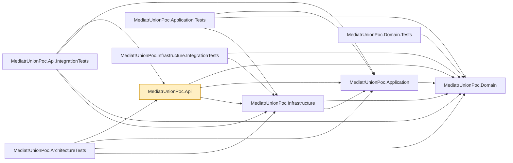

# MediatrUnionPoc.Api

The ASP.NET Core host. One controller, `ProductsController`, whose every action does exactly one
thing: send a command/query via MediatR, then `switch` on the returned union to produce an
`IActionResult`. That `switch` is the only place in the whole solution where a union outcome gets
translated into an HTTP status — handlers and validators never touch `IActionResult` or any other
web concern.

Uses the `Microsoft.NET.Sdk.Web` SDK (not the plain `Microsoft.NET.Sdk` the other projects use),
since it's the one project that's actually a runnable web application.

## Dependencies

**Project references:**

- `MediatrUnionPoc.Domain`, `MediatrUnionPoc.Application`, `MediatrUnionPoc.Infrastructure` — the
  full stack; `Program.cs` composes the app by calling each layer's `Add*()` registration method.

**Key packages:**

- `Microsoft.AspNetCore.OpenApi` — generates the OpenAPI document (`/openapi/v1.json`), including
  the request examples described in the repo root `README.md`.

Also carries the repo-wide analyzer package set (`AsyncFixer`, `IDisposableAnalyzers`,
`Microsoft.VisualStudio.Threading.Analyzers`, `SonarAnalyzer.CSharp`, `StyleCop.Analyzers`).



## Usage

Run locally:

```bash
dotnet run --project src/MediatrUnionPoc.Api
```

Then hit `ProductsController`'s endpoints, or browse the generated OpenAPI document. Action names
keep their `Async` suffix in MVC's route/action metadata — `Program.cs` sets
`SuppressAsyncSuffixInActionNames = false` (ASP.NET Core's default is `true`), because
`CreatedAtAction`'s `nameof(GetByIdAsync)` calls would otherwise silently stop matching the action
name MVC registers.

There's nothing to configure beyond what `Program.cs` already wires up — no connection string, no
external service. `MediatrUnionPoc.Infrastructure`'s EF Core provider is in-memory, so each run
starts with an empty product catalog.
