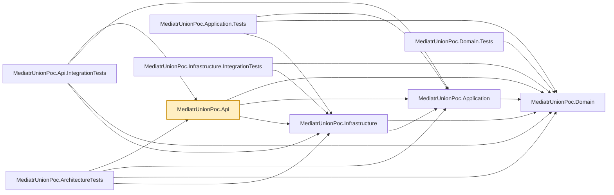

# MediatrUnionPoc.Api

The ASP.NET Core host. Two controllers, `ProductsController` and `ImpersonationController`, whose
every action does exactly one thing: send a command/query via MediatR, then `switch` on the returned union to produce an
`IActionResult`. That `switch` is the only place in the whole solution where a union outcome gets
translated into an HTTP status — handlers and validators never touch `IActionResult` or any other
web concern. See the repo root README's
[Switch-and-unwrap: why controllers never return the union directly](../../README.md#switch-and-unwrap-why-controllers-never-return-the-union-directly)
for why, and its [Authorization](../../README.md#authorization) section for how the caller's
identity (a JWT bearer token) reaches the commands.

## HTTP mapping (`Http/`)

The controller keeps its own exhaustive `switch`; the repeated failure arms are one-line calls to
C# 14 extension members in `MediatrUnionPoc.Api.Http` (`ResultHttpExtensions`):
`error.ToProblemResult(HttpContext)`, `notFound.ToProblemResult(HttpContext, resource: "Product")`,
`notAuthorized.ToProblemResult(HttpContext)`, `errors.ToProblemResult(HttpContext)`,
`preconditionFailed.ToProblemResult(HttpContext)` (412), `conflict.ToProblemResult(HttpContext)`
(409) and `missingIfMatch.ToProblemResult(HttpContext)` (428). Every failure body is
`application/problem+json`; the 404 carries a `code` member (`"NOT_FOUND"`), and the 429 the rate
limiter writes one (`"RATE_LIMITED"`, `ResultHttpExtensions.RateLimitedCode`).

- `HttpMappingOptions` (registered by `AddResultHttpMapping(Action<HttpMappingOptions>?)` in
  `Program.cs`, resolved through `HttpContext.RequestServices`): `ErrorStatusCodes` maps an
  `Error.Code` to a status (default `VALIDATION_ERROR` to 400; `DefaultErrorStatusCode` 500 for the
  rest), `IncludeTypeUris` / `TypeUris` control the RFC 7807 `type` member.
- Each extension takes optional per-call overrides (`statusCode`, `title`, `detail`) to treat one
  case differently, and everything is public: write a hand-rolled arm or your own extension members
  whenever the built-ins do not fit.

## API versioning (`Http/ApiVersions.cs`, `OpenApi/`)

Routes are `/api/v{version:apiVersion}/...` (`Asp.Versioning.Mvc`, URL-segment reader); both
controllers declare `[ApiVersion(ApiVersions.V1)]`. `ApiVersions` is the one place a version number
or the versioned route prefix is spelled. `ReportApiVersions` puts `api-supported-versions` on every
versioned response. Health, OpenAPI and Scalar endpoints are plain endpoints and stay unversioned.

- **Generated URLs.** `ProductsController.VersionedUrl` builds the `Location` of a create and the
  base URL of the `Link` paging headers (`SetPagingHeaders(page, canonicalUrl)`) from the versioned
  route, so they are `/api/v1/...` whichever route the request used.
- **Transitional alias.** Each controller has a second `[Route]` (`ApiVersions.UnversionedAliasPrefix`,
  `Order = 1` so link generation prefers the versioned route) and `AssumeDefaultVersionWhenUnspecified`
  is on, so `/api/products` behaves as version 1. Remove both to retire it; the alias is not in the
  OpenAPI document.
- **OpenAPI.** `AddVersionedOpenApi(documentName)` registers one document per version with every
  transformer, including only the operations of that API explorer group (named `v1`, ...) reached
  through the versioned route template. `Asp.Versioning.OpenApi` is not usable with
  `Microsoft.AspNetCore.OpenApi` 11 (it needs `Microsoft.OpenApi` 2.x; NU1107), hence the manual
  registration and the `AV0029`/`AV0030` `NoWarn` in the project file. Scalar lists each document.
- **Errors.** A version that is not served is an unmatched route: the standard `404` (or `401` for an
  anonymous caller) problem with the `traceId`. See the repo root README's
  [API versioning](../../README.md#api-versioning).

## ETag and If-Match (`Http/`)

Products carry an optimistic-concurrency version, exposed as a weak ETag `W/"n"`. `GET` by id and
`POST` return it in the `ETag` header (and `ProductDto` has a `version` member); a successful `PUT`
returns the new one with `204`, a successful `PATCH` with `200`. `PUT` and `PATCH` require
`If-Match`: missing is `428`, malformed is a `400`
validation problem naming the header, stale is `412`. On `DELETE` it is optional, and enforced when
present. `IfMatchHeader.Parse` classifies the header (`ProductVersion`, `MissingIfMatch` or
`ValidationErrors`) so all three actions share one parser, and `Response.SetETag(version)`
(`ETagHttpExtensions`) writes the header. The OpenAPI document declares the `409`/`412`/`428` responses
with example bodies (`PreconditionProblemExampleTransformer`) and the `ETag` response header on
actions marked `[ReturnsETag]` (`ETagResponseHeaderTransformer`). See the repo root README's
[Optimistic concurrency](../../README.md#optimistic-concurrency-productversion-etag-and-if-match).

## PATCH: JSON Merge Patch (`Contracts/`, `Http/`, `OpenApi/`)

`PATCH /api/v1/products/{id}` binds a `PatchProductRequest(Optional<string?> Name, Optional<decimal?> Price)`
and sends a `PatchProductCommand`. `[Consumes("application/merge-patch+json")]` makes any other body
media type (plain `application/json` included) a `415` problem; the default JSON input formatter
already accepts `application/*+json`, so the body binds without a custom formatter.
`OptionalJsonConverterFactory` (`Http/`), registered once through `AddJsonOptions` in `Program.cs`,
binds any `Optional<T>`: a missing member stays absent, anything else (an explicit `null` included)
is present, which is how the application tells "leave it alone" from "null is not allowed". Members
the contract does not know are ignored (RFC 7396). `If-Match` is required exactly as for `PUT`
(shared by the controller's `WithRequiredVersionAsync`); success is `200` with the updated
`ProductDto` and the new `ETag`. The OpenAPI document lists the request body as
`application/merge-patch+json` (`ConsumesMediaTypeTransformer`), inlines `Optional<T>` as the
wrapped type with the member not `required` (`OptionalSchemaTransformer`, wired with
`OpenApiOptions.CreateSchemaReferenceId`) and carries a one-field example
(`ProductContractExampleTransformer`). See the repo root README's
[Partial updates](../../README.md#partial-updates-patch-as-json-merge-patch).

## Listing: filters, sort, paging headers (`Contracts/`, `Http/`, `OpenApi/`)

`GET /api/v1/products` binds a `ListProductsRequest` (`Contracts/ProductContracts.cs`) from the query
string (`nameContains`, `minPrice`, `maxPrice`, `ownerId`, `sort`, `pageNumber`, `pageSize`; binding
is case-insensitive) and sends a `GetPagedProductsQuery`. `GetPagedProductsResult` has a real
`ValidationErrors` case, so bad input answers `400` with per-field `errors` like every other
validated action; the action's `switch` has no `Error` special case for validation. The `200` body
is a `PagedResult<ProductDto>` (applied sort, `totalCount`, `totalPages`, `firstPage`, `lastPage`,
`nextPage`, `previousPage`), and `Response.SetPagingHeaders(page)` (`PagingHttpExtensions`) adds
`X-Total-Count` and an RFC 8288 `Link` header (`first`, `prev`, `next`, `last`; `prev`/`next` omitted
at the ends; the request URL with only `pageNumber` replaced). The OpenAPI document declares those
headers on actions marked `[ReturnsPagingHeaders]` (`PagingResponseHeaderTransformer`) and carries an
example paged body (`ProductContractExampleTransformer`). See the repo root README's
[Listing products](../../README.md#listing-products-filtering-sorting-and-paging).

## Authentication (`Authentication/`)

- `AddJwtAuthentication()` (called from `Program.cs`) registers `JwtAuthOptions` (`Authentication:Jwt`:
  `Issuer`, `Audience`, `SigningKey` of at least 32 characters, `ClockSkewSeconds`), validated on
  start by the source-generated `JwtAuthOptionsValidator`, the JWT bearer scheme configured from them
  by `ConfigureJwtBearerOptions` (HS256 only, issuer, audience, lifetime and signature all checked,
  `MapInboundClaims` on so `sub` and `role` arrive as the `NameIdentifier` and `Role` claims the
  Application layer reads), and a fallback policy `RequireAuthenticatedUser`, so every endpoint needs a
  caller unless it opts out with `.AllowAnonymous()` (the health endpoints, and in Development the
  OpenAPI and Scalar endpoints). `Program.cs` calls `UseAuthentication()` before `UseAuthorization()`.
- Only `appsettings.Development.json` carries a signing key, labelled development-only; any other
  environment must supply `Authentication:Jwt:SigningKey` (user secrets, `Authentication__Jwt__SigningKey`,
  a secret store) or the host refuses to start. `dotnet user-jwts` tokens are accepted in Development
  because this configuration adds to, rather than replaces, the `Authentication:Schemes:Bearer` section
  that tool writes.
- `ProblemDetailsAuthorizationResultHandler` (an `IAuthorizationMiddlewareResultHandler`) writes the
  middleware's `401` and `403` as `application/problem+json` with the `traceId`; it runs the framework's
  own handling first (status, `WWW-Authenticate`) and only adds the body, which also keeps
  `UseStatusCodePages` from writing a second one.
- `BearerSecuritySchemeTransformer` (`OpenApi/`) declares the `Bearer` HTTP scheme and requires it in the
  OpenAPI document so Scalar offers an authorization field; every action also declares its `401`.
- `POST` with a valid token that has no `sub` is a `403` (`NotAuthorized` through the usual extension
  member, decided in the controller before any command is sent); see the repo root README's
  [Where the identity comes from](../../README.md#where-the-identity-comes-from).

## Impersonation (`Impersonation/`, `Controllers/ImpersonationController.cs`)

`POST /api/v1/impersonation/tokens` mints a short-lived token acting as another identity, for
`Administrator` and `Support` callers, in every environment. The decisions (role gate, no chaining,
assignable roles, no escalation, mandatory reason) live in the Application layer's
`Features/Impersonation/IssueToken/` slice; this project supplies the parts that need a JWT library:

- `AddImpersonation()` (called from `Program.cs`) registers `ImpersonationOptions` (`Impersonation`:
  `Enabled`, `SigningKey`, `DefaultLifetimeMinutes`, `MaxLifetimeMinutes`, `AssignableRoles`),
  validated on start by the source-generated `ImpersonationOptionsValidator` (ranges) and the
  hand-written `ImpersonationOptionsRules` (key of at least 32 characters, different from the
  ordinary key, required while enabled; default lifetime not above the maximum). The options class also
  implements the Application layer's `IImpersonationSettings`. It also maps the disabled outcome
  (`Error` code `IMPERSONATION_DISABLED`) to `404` in `HttpMappingOptions`.
- `JwtImpersonationTokenIssuer` implements `IImpersonationTokenIssuer`: an HS256 token signed with the
  impersonation key, same issuer and audience as ordinary tokens, carrying `sub`, `role`, the RFC 8693
  `act` object naming the real caller, the `impersonated` marker, `imp_reason` (and `imp_ticket`),
  `jti`, `iat`, `nbf`, `exp`. The application reads the actor and marker back through
  `ImpersonationClaims` (`IsImpersonated()`, `GetActorId()`, in Application).
- `ConfigureJwtBearerOptions` adds the impersonation key to `IssuerSigningKeys` while impersonation is
  enabled, so both kinds of token authenticate under identical validation (HS256 only, issuer,
  audience, lifetime, signature). Switching impersonation off stops accepting the key.
- `ImpersonationController.IssueTokenAsync` answers `404` (the disabled `Error`) to every authenticated
  caller when the switch is off, otherwise sends the command and `switch`es exhaustively over its union
  (`ImpersonationToken` 200, `ValidationErrors` 400, `NotAuthorized` 403, `Error`). Every response carries
  `Cache-Control: no-store`. The request contract's members are nullable so a missing `reason` is a
  per-field validator error, not a model-binding one; the OpenAPI document carries request and response
  examples (`ProductContractExampleTransformer`).

See the repo root README's [Impersonation](../../README.md#impersonation-acting-as-another-identity)
for the rules, the claims, the options table and the operational warning.

## Audit (`Audit/`)

- `AddAudit()` (called from `Program.cs`, after `AddApplication()`) registers `AuditOptions` (`Audit`:
  `Directory`, default `logs/audit` resolved against the content root; validated on start by the
  source-generated `AuditOptionsValidator`; there is no `Enabled` switch), the file-backed `IAuditLog`
  (`FileAuditLog`) and `HttpAuditRequestContext`, which gives the Application layer's `AuditBehavior`
  the request's trace id (`HttpContext.TraceId`) and remote address without Application referencing ASP.NET.
- `FileAuditLog` writes JSON Lines (`AuditEventJson`, one event per line, UTF-8, LF) to
  `audit-yyyyMMdd.jsonl`, one file per UTC day chosen by the event's timestamp, appended under a lock
  and written through to disk. It throws on an IO failure (a Serilog sink would swallow it) so the
  `AuditFailurePolicy` of the request decides what a lost record means. It never deletes a file.
- `UseImpersonationAudit()` (after `UseAuthentication` and `UseUserLogContext`, before
  `UseAuthorization`) adds `ImpersonationAuditMiddleware`: one `Impersonation.Request` event per request
  made under an impersonation token (method, path without the query string, status, `jti`, actor,
  effective id, reason, trace id, source address). Best effort; ordinary requests are not audited.
- Audit events never pass through Serilog. The `AuditBehavior` and middleware log only "the audit
  event could not be written" (event ids 1100 and 1200) through `ILogger`.

See the repo root README's [Audit stream](../../README.md#audit-stream-a-separate-record-of-security-relevant-actions)
for the event shape, what is and is not audited, the failure policies and retention.

## Logging (`Logging/`)

- `UseApiLogging()` (called first in `Program.cs`) makes Serilog the implementation behind `ILogger`
  (`UseSerilog` with the non-static pattern and `preserveStaticLogger: true`, so several hosts in one
  process never fight over `Log.Logger`). Sinks, levels and the machine, process and thread enrichers
  come from the `Serilog` section of `appsettings*.json`; the application name, version and
  environment come from the host, and any `ILogEventSink` registered in DI is added (the integration
  tests use this to capture events). Sinks: console (readable in Development, compact JSON elsewhere)
  and a daily rolling JSON file at `logs/log-.jsonl`, 14 files kept. Seq is not included; a new sink
  is configuration only.
- `UseApiRequestLogging()` (after `TraceIdMiddleware`, before `UseExceptionHandler`) writes one
  `HTTP {RequestMethod} {RequestPath} responded {StatusCode} in {Elapsed} ms` line per request with
  `TraceId` and the caller's properties. Health probes log at `Debug`; a 500 the exception handler
  already logged is a `Warning`, so an unhandled exception stays a single `Error`.
- `UseUserLogContext()` (after `UseAuthentication`) pushes `UserId`, `IsImpersonated` and
  `ImpersonatedBy` (from `RequestLogProperties`, using `ImpersonationClaims`) onto the log context for
  the rest of the request. Nothing else is read from the request: no tokens, headers or bodies.
- The `TraceId` scope opened by `TraceIdMiddleware` surfaces as a real `TraceId` property on every
  event (verified by tests), so `TraceIdMiddleware` is unchanged.
- `GlobalExceptionHandler` and `LoggingBehavior` use `[LoggerMessage]` methods with stable event ids
  (2000 and 2001; 1000 and 1001).

## Trace id and unhandled exceptions (`Http/`)

- **Trace id.** `HttpContext.TraceId` (extension member in `HttpContextTraceExtensions`) is the
  single accessor: the W3C trace id of `Activity.Current` when there is one (so it joins to
  distributed traces), otherwise `HttpContext.TraceIdentifier`; never empty. It appears in three
  places, always with the same value: the `traceId` member of **every** `application/problem+json`
  body (including framework-generated ones: model-binding 400, routing 404, 415, unhandled 500,
  via `AddApiProblemDetails()` + `UseStatusCodePages()`), an `X-Trace-Id` header on **every**
  response (success included; success bodies are unchanged), and a `TraceId` logging scope opened
  by `TraceIdMiddleware` so every log line written during the request carries it (as the `TraceId`
  property under Serilog).
- **Global exception handler.** `GlobalExceptionHandler` (`IExceptionHandler`, wired with
  `AddExceptionHandler` + `UseExceptionHandler`) turns any exception nothing else caught into a 500
  problem body. There is no per-exception-type status mapping: expected outcomes are unions and
  everything else is a 500 (an `Error` case still maps through `HttpMappingOptions`). The title is
  generic; `detail` (the exception text) is written only when the environment is Development. The
  exception is logged at Error with structured properties (the trace id comes from the scope).
  A client abort (`OperationCanceledException` while `RequestAborted` is cancelled) is swallowed:
  no body, Debug log only.
- **Exception-tracking plug-in points.** No tracker is bundled; exceptions are in the Serilog console
  and file output. The trace id is the join key to whichever you add: OpenTelemetry (vendor-neutral
  exception events on spans) or Sentry.

Uses the `Microsoft.NET.Sdk.Web` SDK (not the plain `Microsoft.NET.Sdk` the other projects use),
since it's the one project that's actually a runnable web application.

## Health checks and options (`Health/`)

- `AddHealthEndpoints()` registers `HealthEndpointsOptions` and the health checks;
  `MapHealthEndpoints()` maps the endpoints. Both are called from `Program.cs`.
- `GET /health/live` runs no checks (proves the process answers). `GET /health/ready` runs the
  checks tagged `ready`: a `SELECT 1` round trip on `AppDbContext` (`AddDbContextCheck`, from
  `Microsoft.Extensions.Diagnostics.HealthChecks.EntityFrameworkCore`). Both are
  `.AllowAnonymous().DisableRateLimiting()` and return the default plain-text status only (`503` when
  unhealthy).
- Caveat: with the default private in-memory SQLite database the readiness check is trivially
  healthy; it is only meaningful with a real `ConnectionStrings:Products`.
- **Options convention for new settings:** `AddOptions<T>().BindConfiguration("Section")
  .ValidateOnStart()` plus an `[OptionsValidator]` source-generated `IValidateOptions<T>`
  (`HealthEndpointsOptionsValidator`) driven by DataAnnotations on the options class. Configure the
  paths with `HealthEndpoints:LivePath` / `HealthEndpoints:ReadyPath` (must start with `/`).

## CORS (`Cors/`)

- `AddApiCors()` registers `ApiCorsOptions` (section `Cors`, validated on start by
  `ApiCorsOptionsValidator` and the `CorsOriginList` / `CorsTokenList` attributes) and one default
  policy built from it; `UseApiCors()` applies it to every request. No `[EnableCors]` anywhere.
- No configuration means no allowed origin and no CORS headers. The wildcard `*` is rejected in every
  list. Only `appsettings.Development.json` lists origins (the localhost dev servers).
- Defaults live in `ApiCorsOptions.DefaultAllowedMethods` / `DefaultAllowedHeaders` /
  `DefaultExposedHeaders`; read the effective lists with `GetAllowedMethods()` etc. The lists are
  nullable because the configuration binder appends configured items to an array that already has
  defaults.
- Pipeline position: after routing and HTTPS redirection, before `UseAuthentication`, so a preflight
  (no `Authorization` header) is answered before the fallback authorization policy can refuse it. It
  sits inside `TraceIdMiddleware`, request logging and the exception handler, so every CORS answer
  carries `X-Trace-Id`. See the root README's [CORS](../../README.md#cors-letting-a-browser-client-call-the-api)
  section for the options table and the exposed-headers contract.

## Rate limiting (`RateLimiting/`)

- `AddApiRateLimiting()` registers `RateLimitingOptions` (section `RateLimiting`, one `RateLimitPolicyOptions`
  per policy, validated on start by the source-generated `RateLimitingOptionsValidator` and
  `RateLimitPolicyOptionsValidator`), the framework's rate limiter and three fixed-window policies named in
  `RateLimitPolicyNames`: `Reads`, `Writes`, `Impersonation`. The limits are read once through `IOptions`
  (restart to change; with `IOptionsMonitor` an invalid reloaded value made every later request a `500`).
- `RateLimitCaller.From(HttpContext)` is the one definition of the partition: `user:<sub>` for an authenticated
  caller, `user:<actor>` (the `act` subject, never the effective identity) for an impersonated one, else
  `ip:<address>` (`ip:unknown` when the connection has none).
- `UseApiRateLimiting()` sits after `UseImpersonationAudit()` and before `UseAuthorization()`.
  `MapControllers().WithDefaultRateLimiting()` gives every action that declares nothing the `Reads` policy;
  actions opt into another with `[EnableRateLimiting(RateLimitPolicyNames.Writes)]`, and only an explicit
  `DisableRateLimiting()` exempts an endpoint (health, and the Development OpenAPI and Scalar endpoints).
- `RateLimitRejectionHandler` (the limiter's `OnRejected`) writes the `429` problem (`code` `RATE_LIMITED`,
  `traceId`, `Retry-After`), logs a `Warning` (event id 1300) and, for the `Impersonation` policy only, a
  best-effort audit event (`Impersonation.IssueToken`, outcome `RateLimited`; a failed write is event id 1301).
- `OpenApi/RateLimitResponseTransformer` declares the `429` (with `Retry-After` and an example) on every
  operation that is not exempt.

## Forwarded headers (`Proxies/`)

- `AddApiForwardedHeaders()` registers `ApiForwardedHeadersOptions` (section `ForwardedHeaders`,
  `TrustedProxies`: IP addresses or CIDR networks, validated on start by `ApiForwardedHeadersOptionsValidator`)
  and, when any are configured, the framework's `ForwardedHeadersOptions` trusting exactly those proxies for
  `X-Forwarded-For` and `X-Forwarded-Proto`.
- `UseApiForwardedHeaders()` is the first middleware, and adds nothing at all when no proxy is configured, so
  a client-supplied `X-Forwarded-For` is ignored by default. The address it produces feeds the rate limiter,
  the request log and the audit `sourceIp`. See the root README's
  [Rate limiting](../../README.md#rate-limiting-a-budget-per-caller) section.

## Dependencies

**Project references:**

- `MediatrUnionPoc.Domain`, `MediatrUnionPoc.Application`, `MediatrUnionPoc.Infrastructure` — the
  full stack; `Program.cs` composes the app by calling each layer's `Add*()` registration method.

**Key packages:**

- `Microsoft.AspNetCore.Authentication.JwtBearer` — the JWT bearer scheme (not part of the shared
  framework). Same `11.0.0-rc.1` build as the other ASP.NET Core packages.
- `Asp.Versioning.Mvc`, `Asp.Versioning.Mvc.ApiExplorer` — URL-segment API versioning and the
  per-version API explorer groups the OpenAPI documents are built from.
- `Microsoft.AspNetCore.OpenApi` — generates one OpenAPI document per API version (`/openapi/v1.json`), including
  the request examples described in the repo root `README.md`.
- `Serilog.AspNetCore` (console sink, request logging), `Serilog.Settings.Configuration`,
  `Serilog.Sinks.File`, `Serilog.Formatting.Compact`, `Serilog.Enrichers.Environment`,
  `Serilog.Enrichers.Process`, `Serilog.Enrichers.Thread` — logging behind `ILogger`, this project
  only.
- `Microsoft.Extensions.Diagnostics.HealthChecks.EntityFrameworkCore` — the readiness database
  check. Pinned to `10.0.12` to match EF Core (the 11.x line requires EF Core 11).

Also carries the repo-wide analyzer package set (`AsyncFixer`, `IDisposableAnalyzers`,
`Microsoft.VisualStudio.Threading.Analyzers`, `SonarAnalyzer.CSharp`, `StyleCop.Analyzers`).



## Usage

Run locally:

```bash
dotnet run --project src/MediatrUnionPoc.Api
```

The default launch profile listens on `http://localhost:5233`. Hit `ProductsController`'s endpoints
(the complete endpoint-by-outcome table is the repo root README's
[The HTTP contract](../../README.md#the-http-contract-every-endpoint-and-outcome)), or browse the
OpenAPI document (`/openapi/v1.json`) and Scalar UI (`/scalar`), both Development-only (and anonymous;
everything else needs a bearer token, see [Authentication](#authentication-authentication)). Action names
keep their `Async` suffix in MVC's route/action metadata — `Program.cs` sets
`SuppressAsyncSuffixInActionNames = false` (ASP.NET Core's default is `true`), because
the `Url.Action(nameof(GetByIdAsync), ...)` call that builds `Location` would otherwise silently stop matching the action
name MVC registers.

In Development there is nothing to configure beyond what `Program.cs` already wires up (the
development signing key ships in `appsettings.Development.json`). Persistence is SQLite;
with no `ConnectionStrings:Products` value the app uses a private in-memory database created at
startup, so each run starts with an empty product catalog. Set `ConnectionStrings:Products` to a
SQLite connection string (for example `Data Source=products.db`) to persist across runs.
