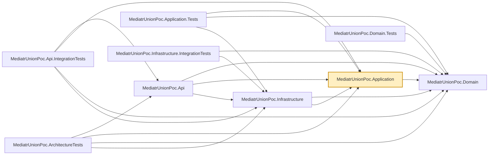

# MediatrUnionPoc.Application

The core of the proof of concept. Commands, queries, handlers, and validators, organized as
**[vertical slices](../../README.md#architectural-patterns)** under `Features/Products/<Operation>/` (Create, Update, Delete, GetById,
GetPaged) rather than by technical layer — everything one operation needs lives in one folder.
`Common/` holds the shared pipeline machinery: marker interfaces (`ICommand<TResponse>`,
`ITransactionalCommand<TResponse>`, `IQuery<TResponse>`, `IValidatable<TSelf>`), the MediatR
pipeline behaviors (`LoggingBehavior`, `ValidationBehavior`, `TransactionBehavior`), and the
meaning-free *shared* case types (`Success`, `NotFound`, `Error`, `ValidationErrors`, `Failure`,
`NotAuthorized`) that the per-feature result unions compose from alongside their own *bespoke*
case types (e.g. `ProductDto`).

Every command/query returns a [`union`](../../README.md#the-c-union-type) of exactly the outcomes
that operation can produce (e.g. `union CreateProductResult(ProductDto, ValidationErrors, Error)`)
instead of throwing for an expected outcome — see the repo root README's
["No exceptions for expected outcomes"](../../README.md#no-exceptions-for-expected-outcomes)
section for the full rationale, and its [Glossary](../../README.md#glossary) for any term below
that isn't self-explanatory.

## Dependencies

**Project references:**

- `MediatrUnionPoc.Domain` — `Product`, the Vogen value objects, and the repository/unit-of-work
  interfaces this layer's handlers depend on.

**Key packages:**

- `MediatR` — in-process request/response dispatch and the pipeline behavior pipeline.
- `FluentValidation` / `FluentValidation.DependencyInjectionExtensions` — per-command/query
  validators, invoked generically by `ValidationBehavior`.
- `Microsoft.Extensions.DependencyInjection` — registers MediatR, the behaviors, and the
  validators from `DependencyInjection.cs`.

Also carries the repo-wide analyzer package set (`AsyncFixer`, `IDisposableAnalyzers`,
`Microsoft.VisualStudio.Threading.Analyzers`, `SonarAnalyzer.CSharp`, `StyleCop.Analyzers`).

This project is also referenced directly (not through the solution's normal build graph) by the
four scratch projects under `tests/CompileTimeChecks/`, which build in isolation against it to
prove union/`ShouldCommit` exhaustiveness is a real compiler error — see
`tests/CompileTimeChecks/README.md`.

## Usage

Registered via `AddApplication()` in `DependencyInjection.cs`, called from
`MediatrUnionPoc.Api`'s `Program.cs`. That one call wires up MediatR (scanning this assembly for
handlers), the pipeline behaviors in their required order (`LoggingBehavior` →
`ValidationBehavior` → `TransactionBehavior`), and all FluentValidation validators.

To add a new operation: create a new `Features/Products/<Operation>/` folder with a
request/response union pair, a handler, and (if the request needs validation) a validator —
mirror an existing slice such as `Features/Products/Create/`. Choose the request's marker
interface based on what it does:

- Read-only → `IQuery<TResponse>`.
- Mutates state, no transaction needed → `ICommand<TResponse>`.
- Mutates state, needs `TransactionBehavior` → `ITransactionalCommand<TResponse>`, and the
  response union must implement `ITransactionOutcome<TResponse>` (a `static abstract bool
  ShouldCommit(TResponse)`, exhaustively switching over that union's own cases).
- Needs `ValidationBehavior` to short-circuit before the handler runs → the response union also
  implements `IValidatable<TSelf>` (`static abstract TSelf FromValidationErrors(ValidationErrors)`).
