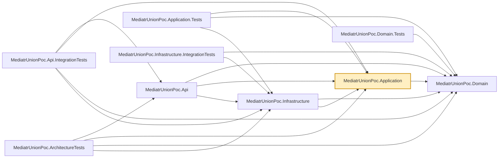

# MediatrUnionPoc.Application

The core of the proof of concept. Commands, queries, handlers, and validators, organized as
**[vertical slices](../../docs/glossary.md#architectural-patterns)** under `Features/Products/<Operation>/` (Create, Update, Patch, Delete, GetById,
GetPaged) rather than by technical layer — everything one operation needs lives in one folder.
`Patch` is the partial update (JSON Merge Patch): its command carries `Optional<string?>` /
`Optional<decimal?>` (`Common/Optional.cs`, a serializer-free "absent or present" struct, present
values may be `null` so an explicit JSON `null` reaches the validator and fails it), and it shares
the load / ownership / version steps with Update (`Features/Products/Common/ProductChangeExtensions`)
and the name and price rules with Create and Update (`ProductRuleExtensions`).
`Common/` holds the shared pipeline machinery: marker interfaces (`ICommand<TResponse>`,
`ITransactionalCommand<TResponse>`, `IQuery<TResponse>`, `IRequiresAuthorization`,
`IValidatable<TSelf>`, `IAuthorizable<TSelf>`, `ITransactionOutcome<TSelf>`,
`ICommitFailable<TSelf>`, `IAuditableRequest<TResponse>`), the MediatR pipeline behaviors (`LoggingBehavior`,
`AuditBehavior`, `AuthorizationBehavior`, `ValidationBehavior`, `TransactionBehavior`), the audit
abstractions (`Common/Auditing/`: `IAuditLog`, `AuditEvent`, `AuditEventJson`, `IAuditRequestContext`), the authorization
requirements and handlers (`Common/Authorization/`), and the meaning-free *shared* case types
(`Success`, `NotFound<TId>`, `Error`, `ValidationErrors`, `Failure`, `NotAuthorized`,
`PreconditionFailed`, `Conflict`, one file each in `Common/Results/`) that the per-feature result
unions compose from alongside their own *bespoke* case types (e.g. `ProductDto`). `Failure` is
defined but no Products union declares it.

Every command/query returns a [`union`](../../docs/union-type.md#the-c-union-type) of exactly the outcomes
that operation can produce (e.g. `union CreateProductResult(ProductDto, ValidationErrors, Error, Conflict)`)
instead of throwing for an expected outcome — see the documentation's
["No exceptions for expected outcomes"](../../docs/no-exceptions.md#no-exceptions-for-expected-outcomes)
section for the full rationale, and its [Glossary](../../docs/glossary.md#glossary) for any term below
that isn't self-explanatory.

`GetPaged` lists the products matching optional filters in a requested order: the query carries the
plain filter values and the `sort` text (`name,-price`), `ProductSortParser` turns that text into
the Domain's allowlisted `ProductSort` keys, and the handler passes criteria and sort to the
repository without knowing how they are evaluated. `GetPagedProductsResult` declares a
`ValidationErrors` case, so `GetPagedProductsValidator` reports one failure per problem, each naming
its field. `AddApplication` registers `TimeProvider.System` (unless the host already registered a
clock); `CreateProductHandler` stamps `Product.CreatedAt` from it.

## Dependencies

**Project references:**

- `MediatrUnionPoc.Domain` — `Product`, the Vogen value objects, and the repository/unit-of-work
  interfaces this layer's handlers depend on.

**Key packages:**

- `MediatR` — in-process request/response dispatch and the pipeline behavior pipeline.
- `FluentValidation` / `FluentValidation.DependencyInjectionExtensions` — per-command/query
  validators, invoked generically by `ValidationBehavior`.
- `Microsoft.Extensions.DependencyInjection` — registers MediatR, the behaviors, and the
  validators from `DependencyInjection.cs`.

Also carries the repo-wide analyzer package set (`AsyncFixer`, `IDisposableAnalyzers`,
`Microsoft.VisualStudio.Threading.Analyzers`, `SonarAnalyzer.CSharp`, `StyleCop.Analyzers`).

This project is also referenced directly (not through the solution's normal build graph) by the
four scratch projects under `tests/CompileTimeChecks/`, which build in isolation against it to
prove union/`ShouldCommit` exhaustiveness is a real compiler error — see
`tests/CompileTimeChecks/README.md`.

## Usage

Registered via `AddApplication()` in `DependencyInjection.cs`, called from
`MediatrUnionPoc.Api`'s `Program.cs`. That one call wires up MediatR (scanning this assembly for
handlers), the pipeline behaviors in their required order (`LoggingBehavior` →
`AuditBehavior` → `AuthorizationBehavior` → `ValidationBehavior` → `TransactionBehavior`: the audit
behavior wraps the two refusals so a refused request is still recorded, and who is calling is checked
before whether their input is well-formed), the authorization policies and handlers, a
`TimeProvider`, and all FluentValidation validators. The host must register an `IAuditLog` (there is no
default: auditing cannot be switched off); `IAuditRequestContext` defaults to the ambient `Activity` and no
source address until the host replaces it. To audit a command, implement `IAuditableRequest<TResponse>`.

To add a new operation: create a new `Features/Products/<Operation>/` folder with a
request/response union pair, a handler, and (if the request needs validation) a validator —
mirror an existing slice such as `Features/Products/Create/`. Choose the request's marker
interface based on what it does:

- Read-only → `IQuery<TResponse>`.
- Mutates state, no transaction needed → `ICommand<TResponse>`.
- Mutates state, needs `TransactionBehavior` → `ITransactionalCommand<TResponse>`, and the
  response union must implement `ITransactionOutcome<TResponse>` (a `static abstract bool
  ShouldCommit(TResponse)`, exhaustively switching over that union's own cases) and
  `ICommitFailable<TResponse>` (a `static abstract TSelf FromCommitFailure(CommitFailure)`,
  exhaustively switching over the ways a commit can be refused — a stale write, a uniqueness
  violation — and deciding what each means for this operation; for Create, Update and Patch a uniqueness
  violation on the product name is a `Conflict`). `TransactionBehavior` rolls back and
  returns `FromCommitFailure(...)` when `IUnitOfWork.CommitAsync` reports a failure.
- Needs `ValidationBehavior` to short-circuit before the handler runs → the response union also
  implements `IValidatable<TSelf>` (`static abstract TSelf FromValidationErrors(ValidationErrors)`).
- Needs a role/policy check before the handler → the request implements `IRequiresAuthorization`
  (`Principal`, `PolicyName`) and the response union implements `IAuthorizable<TSelf>`
  (`static abstract TSelf FromNotAuthorized(NotAuthorized)`); `DeleteProductCommand` does this. An
  ownership check that needs the loaded resource happens inside the handler instead (`Update` and
  `Patch`, through `LoadForChangeAsync`).
