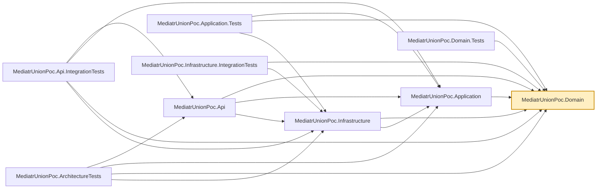

# MediatrUnionPoc.Domain

The innermost layer: the `Product` entity, Vogen-generated value objects (`ProductId`, `Money`),
and the repository/unit-of-work abstractions (`IProductRepository`, `IUnitOfWork`) that outer
layers implement. Holds no MediatR, ASP.NET Core, or EF Core reference — nothing here knows it's
part of a web API or which database persists it.

Value objects are declared with [Vogen](https://github.com/SteveDunn/Vogen) rather than hand-rolled
wrapper structs, so `ProductId`/`Money` get value equality, parsing, and validation from a source
generator instead of boilerplate — see the repo root README's
[Vogen: avoiding primitive obsession](../../README.md#vogen-avoiding-primitive-obsession) for the
full rationale and its [Glossary](../../README.md#glossary) for any term below that isn't
self-explanatory.

## Dependencies

**Project references:** none — this is the dependency graph's root.

**Key packages:**

- `Vogen` — source-generates the strongly-typed value objects.

Also carries the repo-wide analyzer package set (`AsyncFixer`, `IDisposableAnalyzers`,
`Microsoft.VisualStudio.Threading.Analyzers`, `SonarAnalyzer.CSharp`, `StyleCop.Analyzers`) that
every `src/`/`tests/` project (other than the `tests/CompileTimeChecks` scratch probes) carries;
see `.editorconfig` for the severities configured for them.

## Usage

This project is a plain class library — nothing runs it directly. It's consumed by
`MediatrUnionPoc.Application` (which builds commands/queries around `Product` and the repository
interfaces), and, via `ProjectReference`, transitively by every other project in the solution.

When changing the `Product` entity or the Vogen value objects, check
`src/MediatrUnionPoc.Infrastructure` for the hand-written EF Core `ValueConverter`s — they're not
generated from Vogen's own converter support, specifically so this project stays free of an EF
Core reference; a shape change here usually means a matching change there.
