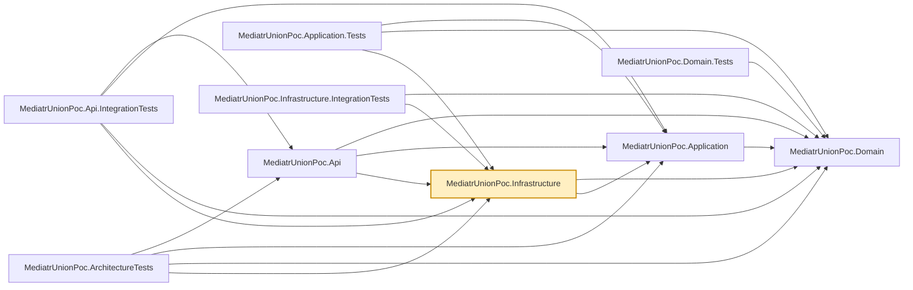

# MediatrUnionPoc.Infrastructure

Implements the persistence-facing interfaces `MediatrUnionPoc.Domain` declares:
`EfCoreUnitOfWork` (see the documentation's
[Unit of Work: one session, every repository](../../docs/transactions.md#unit-of-work-one-session-every-repository)
for what that interface is for), `ProductRepository`, and hand-written EF Core `ValueConverter`s for
the Vogen value objects (`ProductId`, `Money`, `ProductVersion`). The converters are written by hand rather than using
Vogen's own generated EF Core converter support specifically so `MediatrUnionPoc.Domain` never
needs an EF Core package reference.

Persistence is EF Core over SQLite. This is a proof of concept about union-typed MediatR
responses, not about data access, so persistence is kept as thin as it can be while still
exercising `IUnitOfWork`/`IProductRepository` through a real `DbContext` with real transactions.
`ConnectionStrings:Products` selects the database; with no value each service provider gets a
private in-memory database kept alive by one open connection (`ProductsDatabase`). The schema is
created with `EnsureCreated` (no migrations) by `EnsureInfrastructureCreatedAsync`, which
`MediatrUnionPoc.Api`'s `Program.cs` calls at startup.

`ProductVersion` is configured as an EF Core concurrency token, so every `UPDATE`/`DELETE` is
conditioned on the version that was loaded. `EfCoreUnitOfWork.CommitAsync` translates the resulting
`DbUpdateConcurrencyException` into a `ConcurrencyConflict` in the `CommitResult` it returns
(nothing persisted; the caller rolls back). Product names are unique ignoring case and surrounding
whitespace: `Product.NormalizedName` (the Domain's `ProductNames.Normalize` of the name) has a unique
index, and `CommitAsync` reports a violation of it (SQLite extended error 2067 naming
`Products.NormalizedName`) as `UniqueViolation`. Any other constraint failure, such as a primary-key
collision, is not translated and propagates. `ProductRepository.ExistsWithNameAsync` is the
up-front check the handlers use; the index is the backstop for races between two such checks.

Nothing in Infrastructure knows about partial updates: `Product.ApplyChanges` changes only the
properties a `PATCH` named and advances `Version` once, so EF's change tracking issues one
version-conditioned `UPDATE`, exactly as for a full `PUT`.

`ProductRepository.GetPagedAsync` is the only place the Domain's `ProductCriteria` and
`ProductSort` become a query. The name filter matches the normalised search text against
`NormalizedName` (case-insensitive with no provider-specific collation), price bounds compare
`Money` (which defines the relational operators), and the sort is built key by key from the enum
allowlist and always ends in `Id`. `Product.CreatedAt` is stored by `UtcTicksValueConverter` as UTC
ticks in a `long`, because SQLite cannot `ORDER BY` a `DateTimeOffset`'s stored text; it sorts by
instant, and a value read back is the same instant at offset zero.

## Dependencies

**Project references:**

- `MediatrUnionPoc.Domain` — the `Product` entity, Vogen value objects, and the
  `IProductRepository`/`IUnitOfWork` interfaces this project implements.
- `MediatrUnionPoc.Application` — referenced for the vertical-slice types this layer's DI
  registration needs to wire up alongside its own services.

**Key packages:**

- `Microsoft.EntityFrameworkCore` / `Microsoft.EntityFrameworkCore.Sqlite` — the `DbContext` and
  SQLite provider.
- `Microsoft.Extensions.DependencyInjection` — registers the `DbContext` and repository/unit-of-work
  implementations from this project's `DependencyInjection.cs`.

Also carries the repo-wide analyzer package set (`AsyncFixer`, `IDisposableAnalyzers`,
`Microsoft.VisualStudio.Threading.Analyzers`, `SonarAnalyzer.CSharp`, `StyleCop.Analyzers`).

## Usage

Registered via `AddInfrastructure()` in this project's `DependencyInjection.cs`, called from
`MediatrUnionPoc.Api`'s `Program.cs` alongside `AddApplication()`. Handlers in
`MediatrUnionPoc.Application` depend only on `IProductRepository`/`IUnitOfWork` from
`MediatrUnionPoc.Domain` — they never reference this project directly, so swapping the
database only means changing registrations and the `ValueConverter`s here.

If the `Product` entity or its Vogen value objects change shape, update the `ValueConverter`s here
to match — a mismatch surfaces at runtime (EF Core mapping failure), not at compile time.
