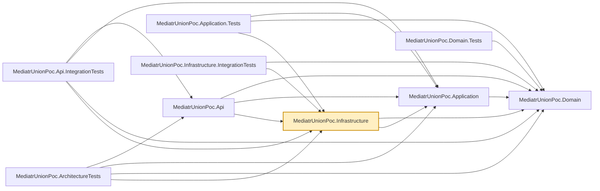

# MediatrUnionPoc.Infrastructure

Implements the persistence-facing interfaces `MediatrUnionPoc.Domain` declares:
`EfCoreUnitOfWork` (see the repo root README's
[Unit of Work: one session, every repository](../../README.md#unit-of-work-one-session-every-repository)
for what that interface is for), `ProductRepository`, and hand-written EF Core `ValueConverter`s for
the Vogen value objects (`ProductId`, `Money`). The converters are written by hand rather than using
Vogen's own generated EF Core converter support specifically so `MediatrUnionPoc.Domain` never
needs an EF Core package reference.

Persistence is EF Core over SQLite. This is a proof of concept about union-typed MediatR
responses, not about data access, so persistence is kept as thin as it can be while still
exercising `IUnitOfWork`/`IProductRepository` through a real `DbContext` with real transactions.
`ConnectionStrings:Products` selects the database; with no value each service provider gets a
private in-memory database kept alive by one open connection (`ProductsDatabase`). The schema is
created with `EnsureCreated` (no migrations) by `EnsureInfrastructureCreatedAsync`, which
`MediatrUnionPoc.Api`'s `Program.cs` calls at startup.

## Dependencies

**Project references:**

- `MediatrUnionPoc.Domain` — the `Product` entity, Vogen value objects, and the
  `IProductRepository`/`IUnitOfWork` interfaces this project implements.
- `MediatrUnionPoc.Application` — referenced for the vertical-slice types this layer's DI
  registration needs to wire up alongside its own services.

**Key packages:**

- `Microsoft.EntityFrameworkCore` / `Microsoft.EntityFrameworkCore.Sqlite` — the `DbContext` and
  SQLite provider.
- `Microsoft.Extensions.DependencyInjection` — registers the `DbContext` and repository/unit-of-work
  implementations from this project's `DependencyInjection.cs`.

Also carries the repo-wide analyzer package set (`AsyncFixer`, `IDisposableAnalyzers`,
`Microsoft.VisualStudio.Threading.Analyzers`, `SonarAnalyzer.CSharp`, `StyleCop.Analyzers`).

## Usage

Registered via `AddInfrastructure()` in this project's `DependencyInjection.cs`, called from
`MediatrUnionPoc.Api`'s `Program.cs` alongside `AddApplication()`. Handlers in
`MediatrUnionPoc.Application` depend only on `IProductRepository`/`IUnitOfWork` from
`MediatrUnionPoc.Domain` — they never reference this project directly, so swapping the
database only means changing registrations and the `ValueConverter`s here.

If the `Product` entity or its Vogen value objects change shape, update the `ValueConverter`s here
to match — a mismatch surfaces at runtime (EF Core mapping failure), not at compile time.
