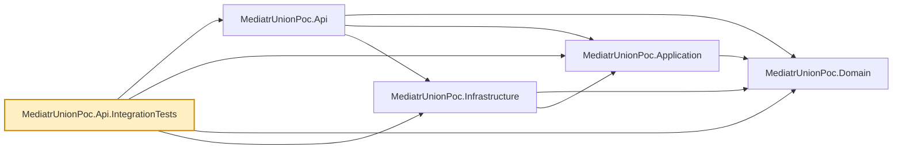

# MediatrUnionPoc.Api.IntegrationTests

Integration tests for `MediatrUnionPoc.Api` — the one place in the suite that boots the real
ASP.NET Core host end-to-end: real DI container, real MediatR pipeline, real controller routing,
and a real (SQLite in-memory) database, exercised through actual HTTP requests via
`Microsoft.AspNetCore.Mvc.Testing`'s `WebApplicationFactory`.

- `ProductsApiFactory.cs` — boots the real host with nothing substituted: with no
  `ConnectionStrings:Products` value each host gets its own private in-memory SQLite database (its
  schema created at startup), so tests using their own factory never see another test's data.
- `ApiAuthentication.cs`, `TestAuthenticationHandler.cs`, `TestIdentityExtensions.cs` — how tests state
  who is calling. By default the factory registers a header-driven test scheme as the default
  authentication scheme, and `client.AsUser("alice", roles)` (or `request.AsUser(...)` for one request)
  sets the identity; a plain client is anonymous. `new ProductsApiFactory(ApiAuthentication.RealJwt)`
  leaves the production bearer scheme as the default instead. The fallback policy and the rest of the
  pipeline are the real ones in both modes.
- `AuthenticationTests.cs` — `401` on every verb with no credentials (problem body, `traceId`), the
  middleware's `403` shape, anonymous health and OpenAPI, the `Bearer` scheme in the OpenAPI document,
  the one coherent policy set, and options validation at start (no key outside Development).
- `JwtBearerAuthenticationTests.cs` (with `TestData/JwtTestTokens.cs`) — real signed tokens: expired,
  wrongly signed, wrongly addressed and malformed ones are `401`; `sub` becomes the owner and a `role`
  claim of `Administrator` passes `DELETE`; a token with no `sub` cannot create.
- `ProductsControllerTests.cs` — exercises the union-to-HTTP-status mapping each controller
  action's `switch` performs, end to end through routing and the real MediatR pipeline behaviors.
  A fresh `ProductsApiFactory` per test gives each test its own isolated database.

- `ProductListingTests.cs` — the list endpoint's query-string contract over HTTP: filter and sort
  binding, per-field `400`s, the paging metadata in the body, `X-Total-Count`, and the `Link`
  header's exact URLs. It swaps in a manually controlled `TimeProvider` (`TestData/ManualTimeProvider`)
  so creation timestamps are deterministic.
- `PatchProductTests.cs` — `PATCH` (JSON Merge Patch): absent versus present members, `415` for other
  media types, `If-Match` rules, ownership, duplicate names and racing patches.
- `DuplicateProductNameTests.cs` — the `409` duplicate-name rule over HTTP, including racing `POST`s
  settled by the unique index.
- `ResultHttpMappingTests.cs` — the `ToProblemResult` extension members and `HttpMappingOptions`
  (custom error-code statuses, per-call overrides, RFC 7807 shape).
- `TraceIdTests.cs`, `TraceIdMiddlewareTests.cs` — the trace id in problem bodies, the `X-Trace-Id`
  header and the log scope.
- `GlobalExceptionHandlerTests.cs`, `UnhandledExceptionTests.cs` — the `500` problem for an
  unexpected exception, Development-only `detail`, and client aborts (using `ThrowingSender` and
  `BlockingSender`).
- `HealthEndpointTests.cs` — `/health/live` and `/health/ready`: `200` plain-text `Healthy`,
  readiness `503` when a `DbConnectionInterceptor` makes the database connection fail, liveness
  unaffected, no credentials needed, no JSON check details, configurable paths, and a
  malformed path failing options validation at host start.
- `OptionalJsonConverterTests.cs` — `Optional<T>` binding.
- `ListingOpenApiTests.cs`, `ConcurrencyOpenApiTests.cs`, `PatchOpenApiTests.cs`,
  `ProductContractExampleTransformerTests.cs` — what the generated OpenAPI document declares:
  list parameters and paging headers, the `ETag` header and `409`/`412`/`428` responses, the merge
  patch media type, and the example bodies.

Nothing here substitutes any dependency other than the database name — this is deliberately the
one seam in the suite that crosses every layer at once. Tests that need a real database but not a
real HTTP host live in `MediatrUnionPoc.Infrastructure.IntegrationTests` instead; tests that need
neither live in `MediatrUnionPoc.Application.Tests`.

## Dependencies

**Project references:** all four `src/` projects — `MediatrUnionPoc.Api`,
`MediatrUnionPoc.Application`, `MediatrUnionPoc.Domain`, `MediatrUnionPoc.Infrastructure` — since
booting the real host pulls in the fully composed application.

**Key packages:**

- `xunit.v3` / `xunit.runner.visualstudio` — test framework (xUnit v3; the test project is an executable) and VSTest runner.
- `Microsoft.AspNetCore.Mvc.Testing` — in-memory `TestServer` and `WebApplicationFactory<Program>`.
- `coverlet.collector` / `Microsoft.NET.Test.Sdk` — coverage collection and the `dotnet test` host.

Also carries the repo-wide analyzer package set (`AsyncFixer`, `IDisposableAnalyzers`,
`Microsoft.VisualStudio.Threading.Analyzers`, `SonarAnalyzer.CSharp`, `StyleCop.Analyzers`), and a
global `Using Include="Xunit"` so test files don't each need `using Xunit;`.



## Usage

```bash
dotnet test tests/MediatrUnionPoc.Api.IntegrationTests
```

Slower than the unit-test projects (each test boots a real host), but still fast in absolute terms
since the database is an in-memory SQLite one, not a real server round-trip.
