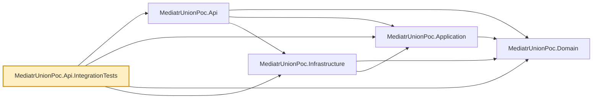

# MediatrUnionPoc.Api.IntegrationTests

Integration tests for `MediatrUnionPoc.Api` — the one place in the suite that boots the real
ASP.NET Core host end-to-end: real DI container, real MediatR pipeline, real controller routing,
and a real (SQLite in-memory) database, exercised through actual HTTP requests via
`Microsoft.AspNetCore.Mvc.Testing`'s `WebApplicationFactory`.

- `ProductsApiFactory.cs` — boots the real host with nothing substituted: with no
  `ConnectionStrings:Products` value each host gets its own private in-memory SQLite database (its
  schema created at startup), so tests using their own factory never see another test's data.
- `ApiRoutes.cs` — the one place the tests spell a URL: the versioned routes (`/api/v1/products`,
  `/api/v1/impersonation/tokens`, `/openapi/v1.json`) every ordinary test uses, plus the `Unversioned`
  members only the alias tests use.
- `ApiVersioningTests.cs` — URL-segment versioning: the transitional unversioned alias behaves as the
  versioned route for each verb group (create, get, list, put, patch, delete, impersonation),
  `api-supported-versions` on every versioned response (and not on health or OpenAPI), `Location` and
  `Link` always on the versioned URL (also when the alias or `v1.0` was used), a version that is not
  served is a `404` problem with the trace id (`401` when anonymous), and the v1 OpenAPI document lists
  only the versioned paths, each operation once, with Scalar pointing at it.
- `CorsTests.cs` — the CORS policy over real HTTP with the fallback policy in place: the allowed origin
  is echoed exactly (with `Vary: Origin` for several origins), a refused origin or an empty
  configuration gets no `Access-Control-*` header, a `PATCH` preflight with `If-Match` and
  `application/merge-patch+json` is answered with no credentials (while the same anonymous caller gets
  `401` on a real request) and carries `X-Trace-Id`, disallowed methods and headers are not listed, the
  exposed-headers list appears on real responses and each header the API emits is present, credentials
  are off unless configured, an authenticated cross-origin write works, and configured lists replace
  the defaults. The host runs in Development, so tests that need a specific list post-configure
  `ApiCorsOptions`.
- `CorsOptionsTests.cs` — the CORS defaults, every validation rule (origins, wildcard, duplicates,
  method and header tokens, max-age bounds, each also refusing host start) and a check that the root
  README names every default method, header and exposed header.
- `ApiAuthentication.cs`, `TestAuthenticationHandler.cs`, `TestIdentityExtensions.cs` — how tests state
  who is calling. By default the factory registers a header-driven test scheme as the default
  authentication scheme, and `client.AsUser("alice", roles)` (or `request.AsUser(...)` for one request)
  sets the identity; a plain client is anonymous. `new ProductsApiFactory(ApiAuthentication.RealJwt)`
  leaves the production bearer scheme as the default instead. The fallback policy and the rest of the
  pipeline are the real ones in both modes.
- `AuthenticationTests.cs` — `401` on every verb with no credentials (problem body, `traceId`), the
  middleware's `403` shape, anonymous health and OpenAPI, the `Bearer` scheme in the OpenAPI document,
  the one coherent policy set, and options validation at start (no key outside Development).
- `JwtBearerAuthenticationTests.cs` (with `TestData/JwtTestTokens.cs`) — real signed tokens: expired,
  wrongly signed, wrongly addressed and malformed ones are `401`; `sub` becomes the owner and a `role`
  claim of `Administrator` passes `DELETE`; a token with no `sub` cannot create.
- `ImpersonationEndpointTests.cs`, `ImpersonationTokenTests.cs`, `ImpersonationOptionsTests.cs` (with
  `TestData/ImpersonationTestSupport.cs`), all on the real JWT scheme — `POST /api/v1/impersonation/tokens`:
  `401` anonymous, `403` for a plain user, Support can mint a plain or `Support` token but not an
  `Administrator` one, an administrator can, mandatory reason and lifetime cap as per-field `400`s, the
  `404` off switch (and `401` still for anonymous), `Cache-Control: no-store`, no token or audit content in any log, and the OpenAPI declaration. The token tests validate a minted token with the
  host's own bearer handler and read `act`, the marker and the reason back on the principal, use it
  against protected endpoints (it owns what it creates, its roles apply), check the two accepted signing
  keys against a random one, expiry (crafted and minted on a past clock), chained impersonation, and that
  switching impersonation off stops the impersonation key being trusted. The options tests cover
  start-up validation (key required outside Development while enabled, not the ordinary key, lifetimes).
- `AuditStreamTests.cs`, `FileAuditLogTests.cs`, `AuditOptionsTests.cs` — the audit stream over real HTTP
  with real JWTs: a mint is audited (actor, effective id, roles, reason, ticket, `tokenId` equal to the
  token's `jti`, trace id, source address), refusals by the handler, by the `Impersonator` policy and by
  validation are audited, every request under a minted token is an `Impersonation.Request` event with the
  same `tokenId` (ordinary reads and health probes are not), the four product mutations carry actor and
  target, audit and operational content never mix, an unwritable audit directory fails a mint closed (no
  token anywhere in the response) and lets a create through with an Error logged; the writer against a
  temp directory (append, daily roll, concurrent writers, a forged line, IO failure); and the options.
- `ProductsControllerTests.cs` — exercises the union-to-HTTP-status mapping each controller
  action's `switch` performs, end to end through routing and the real MediatR pipeline behaviors.
  A fresh `ProductsApiFactory` per test gives each test its own isolated database.

- `ProductListingTests.cs` — the list endpoint's query-string contract over HTTP: filter and sort
  binding, per-field `400`s, the paging metadata in the body, `X-Total-Count`, and the `Link`
  header's exact URLs. It swaps in a manually controlled `TimeProvider` (`TestData/ManualTimeProvider`)
  so creation timestamps are deterministic.
- `PatchProductTests.cs` — `PATCH` (JSON Merge Patch): absent versus present members, `415` for other
  media types, `If-Match` rules, ownership, duplicate names and racing patches.
- `DuplicateProductNameTests.cs` — the `409` duplicate-name rule over HTTP, including racing `POST`s
  settled by the unique index.
- `ResultHttpMappingTests.cs` — the `ToProblemResult` extension members and `HttpMappingOptions`
  (custom error-code statuses, per-call overrides, RFC 7807 shape).
- `TraceIdTests.cs`, `TraceIdMiddlewareTests.cs` — the trace id in problem bodies, the `X-Trace-Id`
  header, and the log scope (surfacing as a `TraceId` property on real Serilog events).
- `LoggingTests.cs`, `RequestLogPropertiesTests.cs` — the Serilog setup: enriched properties on an
  ordinary `ILogger` event (trace id, user, application, environment, machine, process, thread, event
  id), `IsImpersonated`/`ImpersonatedBy` under a minted impersonation token, the request line
  (status, elapsed, trace id, user), health probes silent at the default level and `Debug` when it is
  lowered, a configuration level override honoured, an invalid level failing host start, and no
  bearer token, impersonation token or `Authorization` header in any captured event.
- `GlobalExceptionHandlerTests.cs`, `UnhandledExceptionTests.cs` — the `500` problem for an
  unexpected exception, Development-only `detail`, exactly one `Error` log entry carrying the trace
  id (the request line for the 500 is a `Warning`), and client aborts (using `ThrowingSender` and
  `BlockingSender`).

**Audit files.** Every `ProductsApiFactory` host writes its audit stream to its own directory under the
system temp path (`factory.AuditDirectory`, set through `Audit:Directory`), never under the repository;
`factory.ReadAuditEvents()` reads the events back, and the directory is removed on dispose (and at process
exit as a backstop). The factory also gives every request a fixed remote address, since the in-memory
server has none. A test makes the audit path unwritable by pointing `Audit:Directory` at an existing file.

**Capturing logs.** `ProductsApiFactory` runs the real Serilog setup and registers a
`CapturingLogEventSink` (`factory.LogSink.Events`, shared with derived hosts), which sees every
enriched property. It also restricts the file and console sinks to `Fatal` by configuration, so no
`logs/` file is written (the rolling file sink opens its file on the first write) and test output
stays quiet. Override levels per test with `UseSetting("Serilog:MinimumLevel:...", ...)`.
`CapturingLoggerProvider` remains for the two tests that build a bare `LoggerFactory` without a host.

- `HealthEndpointTests.cs` — `/health/live` and `/health/ready`: `200` plain-text `Healthy`,
  readiness `503` when a `DbConnectionInterceptor` makes the database connection fail, liveness
  unaffected, no credentials needed, no JSON check details, configurable paths, and a
  malformed path failing options validation at host start.
- `OptionalJsonConverterTests.cs` — `Optional<T>` binding.
- `ListingOpenApiTests.cs`, `ConcurrencyOpenApiTests.cs`, `PatchOpenApiTests.cs`,
  `ProductContractExampleTransformerTests.cs` — what the generated OpenAPI document declares:
  list parameters and paging headers, the `ETag` header and `409`/`412`/`428` responses, the merge
  patch media type, and the example bodies.

Nothing here substitutes any dependency other than the database name — this is deliberately the
one seam in the suite that crosses every layer at once. Tests that need a real database but not a
real HTTP host live in `MediatrUnionPoc.Infrastructure.IntegrationTests` instead; tests that need
neither live in `MediatrUnionPoc.Application.Tests`.

## Dependencies

**Project references:** all four `src/` projects — `MediatrUnionPoc.Api`,
`MediatrUnionPoc.Application`, `MediatrUnionPoc.Domain`, `MediatrUnionPoc.Infrastructure` — since
booting the real host pulls in the fully composed application.

**Key packages:**

- `xunit.v3` / `xunit.runner.visualstudio` — test framework (xUnit v3; the test project is an executable) and VSTest runner.
- `Microsoft.AspNetCore.Mvc.Testing` — in-memory `TestServer` and `WebApplicationFactory<Program>`.
- `coverlet.collector` / `Microsoft.NET.Test.Sdk` — coverage collection and the `dotnet test` host.

Also carries the repo-wide analyzer package set (`AsyncFixer`, `IDisposableAnalyzers`,
`Microsoft.VisualStudio.Threading.Analyzers`, `SonarAnalyzer.CSharp`, `StyleCop.Analyzers`), and a
global `Using Include="Xunit"` so test files don't each need `using Xunit;`.



## Usage

```bash
dotnet test tests/MediatrUnionPoc.Api.IntegrationTests
```

Slower than the unit-test projects (each test boots a real host), but still fast in absolute terms
since the database is an in-memory SQLite one, not a real server round-trip.
