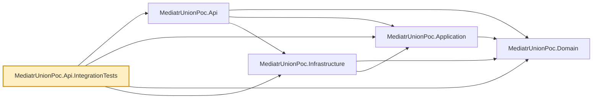

# MediatrUnionPoc.Api.IntegrationTests

Integration tests for `MediatrUnionPoc.Api` — the one place in the suite that boots the real
ASP.NET Core host end-to-end: real DI container, real MediatR pipeline, real controller routing,
and a real (SQLite in-memory) database, exercised through actual HTTP requests via
`Microsoft.AspNetCore.Mvc.Testing`'s `WebApplicationFactory`.

- `ProductsApiFactory.cs` — boots the real host with nothing substituted: with no
  `ConnectionStrings:Products` value each host gets its own private in-memory SQLite database (its
  schema created at startup), so tests using their own factory never see another test's data.
- `ProductsControllerTests.cs` — exercises the union-to-HTTP-status mapping each controller
  action's `switch` performs, end to end through routing and the real MediatR pipeline behaviors.
  A fresh `ProductsApiFactory` per test gives each test its own isolated database.

- `ProductListingTests.cs` — the list endpoint's query-string contract over HTTP: filter and sort
  binding, per-field `400`s, the paging metadata in the body, `X-Total-Count`, and the `Link`
  header's exact URLs. It swaps in a manually controlled `TimeProvider` so creation timestamps are
  deterministic.
- `ListingOpenApiTests.cs` — the list operation's documented parameters, paging response headers and
  example in the generated OpenAPI document.

Nothing here substitutes any dependency other than the database name — this is deliberately the
one seam in the suite that crosses every layer at once. Tests that need a real database but not a
real HTTP host live in `MediatrUnionPoc.Infrastructure.IntegrationTests` instead; tests that need
neither live in `MediatrUnionPoc.Application.Tests`.

## Dependencies

**Project references:** all four `src/` projects — `MediatrUnionPoc.Api`,
`MediatrUnionPoc.Application`, `MediatrUnionPoc.Domain`, `MediatrUnionPoc.Infrastructure` — since
booting the real host pulls in the fully composed application.

**Key packages:**

- `xunit.v3` / `xunit.runner.visualstudio` — test framework (xUnit v3; the test project is an executable) and VSTest runner.
- `Microsoft.AspNetCore.Mvc.Testing` — in-memory `TestServer` and `WebApplicationFactory<Program>`.
- `coverlet.collector` / `Microsoft.NET.Test.Sdk` — coverage collection and the `dotnet test` host.

Also carries the repo-wide analyzer package set (`AsyncFixer`, `IDisposableAnalyzers`,
`Microsoft.VisualStudio.Threading.Analyzers`, `SonarAnalyzer.CSharp`, `StyleCop.Analyzers`), and a
global `Using Include="Xunit"` so test files don't each need `using Xunit;`.



## Usage

```bash
dotnet test tests/MediatrUnionPoc.Api.IntegrationTests
```

Slower than the unit-test projects (each test boots a real host), but still fast in absolute terms
since the database is an in-memory SQLite one, not a real server round-trip.
