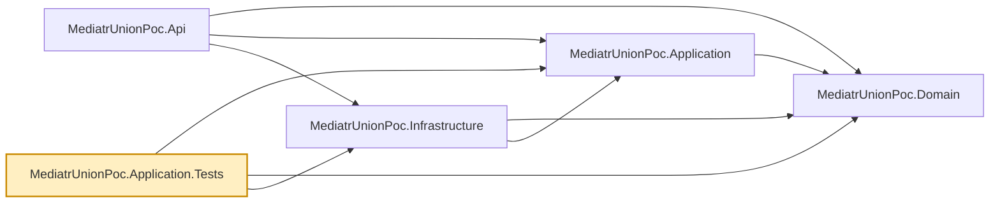

# MediatrUnionPoc.Application.Tests

Unit tests for `MediatrUnionPoc.Application`, organized by what's under test:

- `Unions/` — union case-type behavior, `ITransactionOutcome`/`IValidatable` implementations, and
  `ExhaustivenessTests.cs` (shells out to the real `dotnet build` against the scratch projects
  under `tests/CompileTimeChecks/` — see that folder's `README.md`).
- `Behaviors/` — the MediatR pipeline behaviors (`LoggingBehavior`, `ValidationBehavior`,
  `TransactionBehavior`), including `PipelineRegistrationTests.cs`, which resolves the real,
  DI-built pipeline to prove the registration order (Logging → Validation → Transaction), and that
  a plain `ICommand<TResponse>` never picks up `TransactionBehavior`. `LoggingBehaviorTests.cs`
  proves the behavior is purely observational: it always calls `next` exactly once, returns its
  result unchanged, and propagates rather than swallows an exception `next` throws.
- `Handlers/` — every command/query handler (`Create`, `Update`, `Delete`, `GetById`,
  `GetPaged`), with `IProductRepository` substituted via NSubstitute rather than hitting
  `MediatrUnionPoc.Infrastructure`'s real EF Core provider. (The tests that *do* exercise the real
  EF Core InMemory provider — `EfCoreUnitOfWorkTests` and `ProductRepositoryTests` — live in
  `MediatrUnionPoc.Infrastructure.IntegrationTests` instead, since they're database tests, not
  handler tests.)
- `Validators/` — the FluentValidation validators for each command/query.

`Unions/ResultShouldCommitTests.cs` covers `CreateProductResult.ShouldCommit` and
`UpdateProductResult.ShouldCommit` — the two result unions `TransactionBehaviorTests` doesn't
already exercise via `DeleteProductResult` — since a mistake in either union's own `ShouldCommit`
switch is exactly the per-union authoring error the whole `ITransactionOutcome` pattern exists to
isolate (see the repo root README's
[Shared case types are meaning-free](../../README.md#shared-case-types-are-meaning-free-transactionbehavior-cant-assume-what-a-case-means)
for why that pattern exists).

None of these tests boot the ASP.NET Core host — that's
`MediatrUnionPoc.Api.IntegrationTests`'s job.

## Dependencies

**Project references:** `MediatrUnionPoc.Application` and `MediatrUnionPoc.Domain` for the code
under test, plus `MediatrUnionPoc.Infrastructure` — needed only because `PipelineRegistrationTests`
and `NonTransactionalCommandTests` call `AddInfrastructure()` to resolve the real, fully-composed
MediatR pipeline from DI; neither test touches a database.

**Key packages:**

- `xunit.v3` / `xunit.runner.visualstudio` — test framework (xUnit v3; the test project is an executable) and VSTest runner.
- `NSubstitute` — mocks `IProductRepository` for handler tests.
- `FluentValidation` — referenced directly to test validators in isolation from the handlers that
  use them.
- `Microsoft.Extensions.DependencyInjection` — resolves services from the DI container in the
  pipeline-registration tests.
- `coverlet.collector` / `Microsoft.NET.Test.Sdk` — coverage collection and the `dotnet test` host.

Also carries the repo-wide analyzer package set (`AsyncFixer`, `IDisposableAnalyzers`,
`Microsoft.VisualStudio.Threading.Analyzers`, `SonarAnalyzer.CSharp`, `StyleCop.Analyzers`), and a
global `Using Include="Xunit"` so test files don't each need `using Xunit;`.



## Usage

```bash
dotnet test tests/MediatrUnionPoc.Application.Tests
dotnet test --filter "FullyQualifiedName~Name"  # run a single test/class by (partial) name
```

`Unions/ExhaustivenessTests.cs` is slower than the rest of the suite — each `[Fact]` shells out to
a real `dotnet build` against an isolated scratch project, with a 3-minute timeout per build.
Filter it out (`--filter "FullyQualifiedName!~ExhaustivenessTests"`) when iterating on everything
else.
