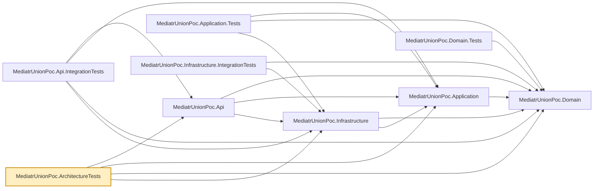

# MediatrUnionPoc.ArchitectureTests

Enforces the layering CLAUDE.md documents as intended for this solution, using
[NetArchTest.Rules](https://github.com/BenMorris/NetArchTest) to assert on the compiled assemblies
directly — so a rule violation is caught even if every individual `.csproj`'s `ProjectReference`s
happen to still look correct. `LayeringTests.cs` currently checks:

- Domain has no dependency on Application, Infrastructure, or Api.
- Application has no dependency on Infrastructure or Api.
- Infrastructure has no dependency on Api.
- Only Infrastructure references `Microsoft.EntityFrameworkCore` — not Domain, not Application.
- Domain does not reference MediatR.
- Neither Domain nor Application references a JWT or identity-token library (`Microsoft.IdentityModel`,
  `System.IdentityModel.Tokens`): impersonation tokens are signed in Api behind an Application abstraction.
- Neither Domain nor Application references Serilog or the ASP.NET Core HTTP pipeline (`Microsoft.AspNetCore.Http`):
  the audit stream is an Application abstraction with its implementation and middleware in Api.
- Neither Domain, Application nor Infrastructure references `Asp.Versioning`: a version is a property of the
  HTTP address, so it lives in Api only.
- Only Api references ASP.NET Core MVC (`Microsoft.AspNetCore.Mvc`) — union-to-HTTP translation stays in the controller.

## Dependencies

**Project references:** all four `src/` projects — `MediatrUnionPoc.Api`,
`MediatrUnionPoc.Application`, `MediatrUnionPoc.Domain`, `MediatrUnionPoc.Infrastructure` — purely
so `Types.InAssembly(...)` can load each compiled assembly by referencing a type from it; these
tests never call into the projects' actual behavior.

**Key packages:**

- `NetArchTest.Rules` — the dependency-direction assertions themselves.
- `xunit.v3` / `xunit.runner.visualstudio` — test framework (xUnit v3; the test project is an executable) and VSTest runner.
- `coverlet.collector` / `Microsoft.NET.Test.Sdk` — coverage collection and the `dotnet test` host.

Also carries the repo-wide analyzer package set (`AsyncFixer`, `IDisposableAnalyzers`,
`Microsoft.VisualStudio.Threading.Analyzers`, `SonarAnalyzer.CSharp`, `StyleCop.Analyzers`,
`xunit.analyzers`), and a
global `Using Include="Xunit"`.



## Usage

Runs as part of the normal suite:

```bash
dotnet test --filter "FullyQualifiedName~ArchitectureTests"
```

If you deliberately change the intended dependency direction (e.g. a new project sits between
Application and Infrastructure), update `LayeringTests.cs`'s assertions *and* the "Architecture"
section of the repo root `CLAUDE.md` in the same change — this project exists specifically so
those two descriptions of the layering can't silently drift apart.
