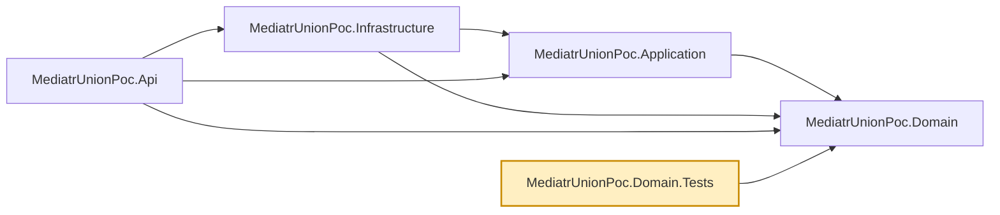

# MediatrUnionPoc.Domain.Tests

Unit tests for `MediatrUnionPoc.Domain` in isolation — no MediatR, no FluentValidation, no EF Core,
no mocking framework. Just the two Vogen value objects and the one entity:

- `MoneyTests.cs` — verifies `Money`'s `Validate` rejects negative amounts and accepts everything
  else.
- `ProductIdTests.cs` — verifies `ProductId`'s `Validate` rejects `Guid.Empty`, and that
  `ProductId.New()` always produces a valid, non-empty id.
- `ProductTests.cs` — verifies `Product.Create` assigns a fresh, distinct id per call, and
  `Product.UpdateDetails` fully replaces name and price without touching identity.

## Dependencies

**Project references:** `MediatrUnionPoc.Domain` only — this project has no dependency on
`Application`, `Infrastructure`, or `Api`, matching Domain's own position as the innermost layer.

**Key packages:**

- `xunit` / `xunit.runner.visualstudio` — test framework and runner.
- `coverlet.collector` / `Microsoft.NET.Test.Sdk` — coverage collection and the `dotnet test` host.

Also carries the repo-wide analyzer package set (`AsyncFixer`, `IDisposableAnalyzers`,
`Microsoft.VisualStudio.Threading.Analyzers`, `SonarAnalyzer.CSharp`, `StyleCop.Analyzers`), and a
global `Using Include="Xunit"` so test files don't each need `using Xunit;`.



## Usage

```bash
dotnet test tests/MediatrUnionPoc.Domain.Tests
```

Runs as part of the normal suite too — `dotnet test` at the solution root includes this project.
