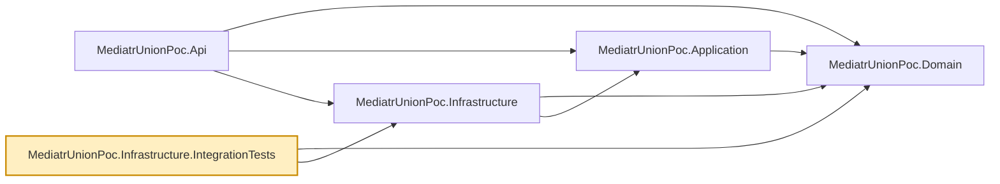

# MediatrUnionPoc.Infrastructure.IntegrationTests

Database integration tests for `MediatrUnionPoc.Infrastructure` — the one place in this repo that
exercises real EF Core providers (InMemory and SQLite) end-to-end, rather than substituting
`IProductRepository`/`IUnitOfWork` with NSubstitute (as `MediatrUnionPoc.Application.Tests`'s
handler tests do).

- `EfCoreUnitOfWorkTests.cs` — confirms a rolled-back `EfCoreUnitOfWork` never reaches the
  database while a committed one does, going through the real `ProductIdValueConverter` and
  `MoneyValueConverter`. Commit, rollback and dispose semantics are theories run against both the
  EF Core InMemory provider and a test-only SQLite `:memory:` connection
  (`TestData/UnitOfWorkTestDatabase`), so the `IUnitOfWork` contract is asserted identically on a
  provider without transactions and on a relational one; only the held-transaction behavior is
  asserted per provider. This is the behavior `TransactionBehavior` depends on; if commit/rollback
  stopped actually controlling persistence, the pipeline-level tests in
  `MediatrUnionPoc.Application.Tests` (which substitute `IUnitOfWork`) would never catch it.
  SQLite is used here only as a transaction host; nothing in `src` references it.
- `ProductRepositoryTests.cs` — covers the query logic `EfCoreUnitOfWorkTests` doesn't:
  `GetPagedAsync`'s ordering (by name) and its skip/take math across multiple pages, plus a plain
  `GetByIdAsync` miss/hit and a `Remove` round trip. Nothing here substitutes `IProductRepository`
  or `AppDbContext` — that's the point of an integration test for a repository, and the paging math
  in particular is never exercised anywhere else with more than one row.

- `ValueConvertersTests.cs` — the converters' delegates in isolation, including rejection of
  invalid stored values.
- `AppDbContextTests.cs` — the EF model metadata (key, length limits, value converters).
- `DependencyInjectionTests.cs` — `AddInfrastructure`'s scoped wiring and shared context.
- `TestData/` — object mothers (`DbContextMother`, `ProductMother`).

This project is kept separate from `MediatrUnionPoc.Application.Tests` specifically because it
talks to a (test-scoped, in-memory) database — a different failure mode and a different speed
profile than the pure unit tests elsewhere in the suite, even though EF Core's InMemory provider
happens to be fast in practice.

## Dependencies

**Project references:** `MediatrUnionPoc.Domain` and `MediatrUnionPoc.Infrastructure` — no
`Application` or `Api` reference; these tests only exercise the persistence layer directly.

**Key packages:**

- `xunit.v3` / `xunit.runner.visualstudio` — test framework (xUnit v3; the test project is an executable) and VSTest runner (`xunit.analyzers` supplies the xUnit-specific Roslyn rules).
- `coverlet.collector` / `Microsoft.NET.Test.Sdk` — coverage collection and the `dotnet test` host.
- `Microsoft.EntityFrameworkCore.Sqlite` — test-only relational provider for the transaction tests (same EF Core version as the rest of the solution).
- `Microsoft.EntityFrameworkCore.InMemory` comes transitively via the `Infrastructure` project
  reference.

Also carries the repo-wide analyzer package set (`AsyncFixer`, `IDisposableAnalyzers`, `xunit.analyzers`,
`Microsoft.VisualStudio.Threading.Analyzers`, `SonarAnalyzer.CSharp`, `StyleCop.Analyzers`), and a
global `Using Include="Xunit"` so test files don't each need `using Xunit;`.



## Usage

```bash
dotnet test tests/MediatrUnionPoc.Infrastructure.IntegrationTests
```

Each test uses its own uniquely-named InMemory database (derived from the test name, so it is
deterministic), so tests never see
each other's data and can run in parallel safely.
